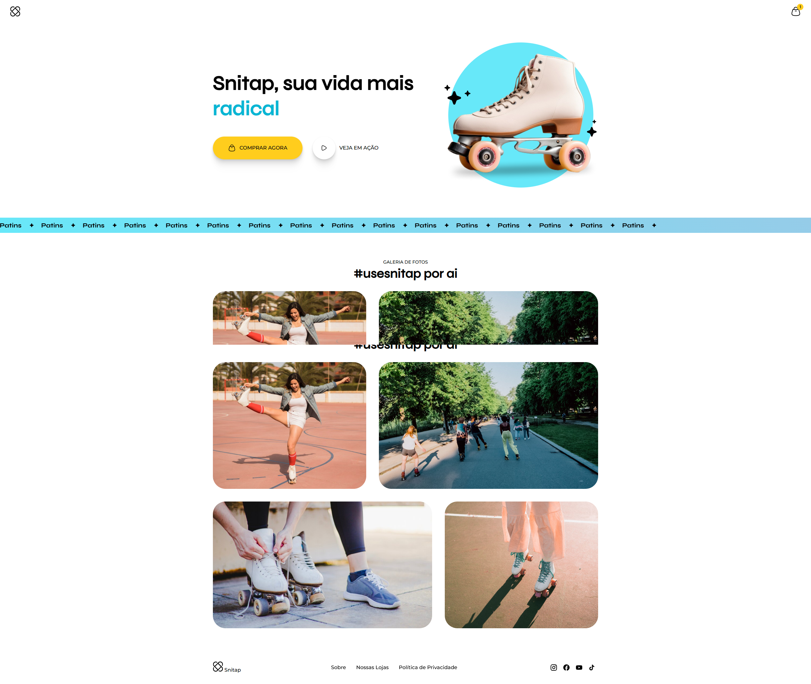

# Landing Page Patins Animada

Landing Page Patins Animada é uma página web que demonstra os aprendizados sobre CSS Animations e Transitions construída com **HTML** e **CSS**, que utiliza técnicas de **GRID** e **FLEX** para a criação de um layout moderno.

[](https://patinsanimada.hallanchristian.com.br)

## Visão Geral

A page possui um design moderno e responsivo e possui animações feitas com css Animations e Transitions.

### Tecnologias Utilizadas

- **HTML5**: Estrutura semântica da página.
- **CSS3**: Estilização e design visual da página.
  - **GRID** e **FLEX**: Usado para alinhar e distribuir os elementos.
  - **Atributos de CSS**: Utilizados para ajustar o espaçamento, estilo de fonte, e outros detalhes visuais e Responsividade.
  - **Animations e Transitions**: Animações e transições utilizando CSS Animations e Transitions.

## Funcionalidades

1. **Header Animado**:
2. **Body Animado**:
3. **Footer Animado**

## Como Executar o Projeto

1. Clone o repositório:
   ```bash
   git clone https://github.com/hallancma/mba-rockeseat-sirius-projetos-06-projeto-landing-page-patins-animada
   ```
2. Abra o arquivo `index.html` em seu navegador para visualizar a página.

## Ver Projeto

Para ver o projeto em funcionamento, você pode visitar o link abaixo:

[Ver Projeto](https://patinsanimada.hallanchristian.com.br/)
